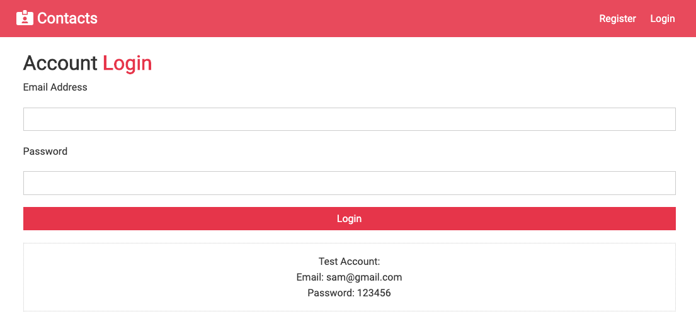
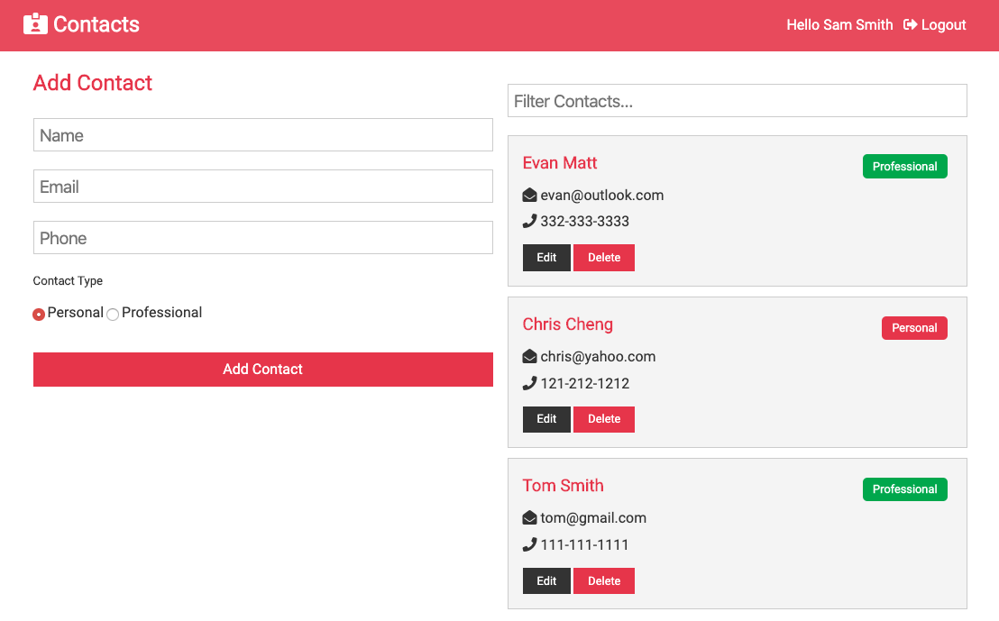
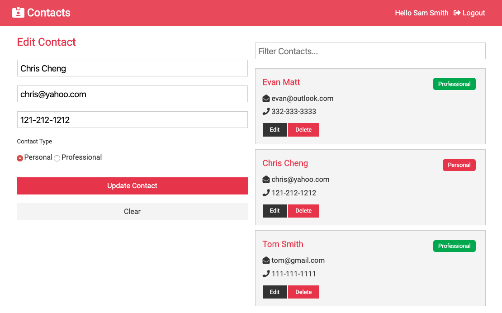

## 📮 Contact Manager

> 一个基于 React 全家桶制作 Contact Manager 项目

[ Contact Manager Online ](https://contact.chenxii.xyz) | Deployed in Heroku | Access maybe slow...

#### Preview | 预览







---

### 技术栈

#### Front End

- react：^16.12.0
- react-router-dom：^5.1.2
- react-transition-group：^4.3.0
- axios：^0.19.1

#### Back End

- express："^4.17.1"
- express-validator: "^6.3.1"
- jsonwebtoken: "^8.5.1",
- mongoose: "^5.8.9",
- bcryptjs: "^2.4.3",
- config: "^3.2.5",

---

### 本地运行

```
git clone https://github.com/ChenxiiCheng/React-Contact-Manager.git
cd React-Contact-Manager
npm install
cd client
npm install
cd ..
// source dir
npm run dev
```
